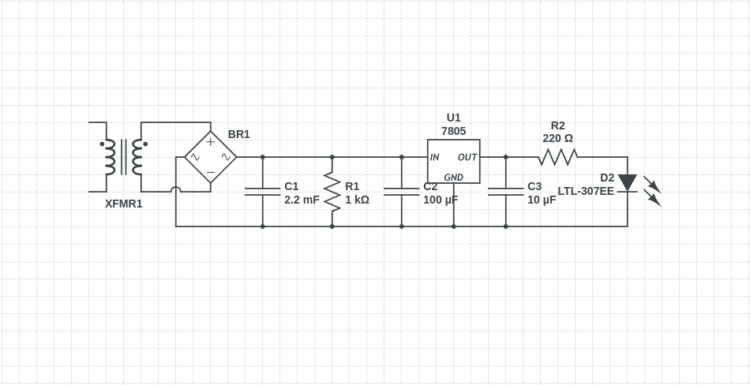
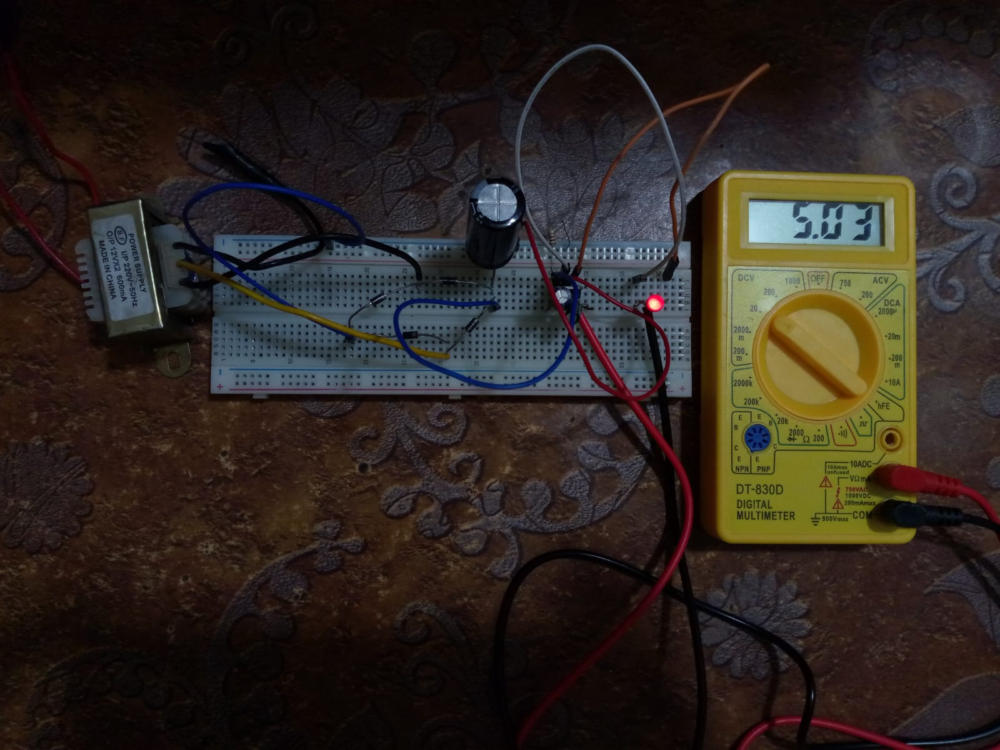

# 01 - Full Wave Bridge Rectifier with 5V Regulator

**Project #01** of my *Learn Electronics Journey*

### Goal
AC to stable DC conversion learning — understand the basic concept of real power supply design.

### What I Built
- **Full Wave Bridge Rectifier** using 4 diodes
- Capacitor filter (smooth output)
- **7805 Voltage Regulator** (5V fixed output)
- LED indicator with current limiting resistor

### Circuit Diagram

### Breadboard Implementation

**Output:** Stable **5.03V** DC (Multimeter reading)

---

### Components Used

| Component          | Value/Spec              | Purpose |
|--------------------|-------------------------|--------|
| Transformer        | 220V-12V AC, 600mA     | Center tap step down AC |
| Bridge Rectifier   | 4x 1N4007              | Full wave rectification |
| Capacitor C1       | 2.2mF (2200µF)         | Main smoothing filter |
| Resistor R1        | 1kΩ                    | Bleeder resistor |
| Capacitor C2       | 100µF                  | Input to regulator |
| 7805 Regulator     | U1                     | 5V fixed output |
| Capacitor C3       | 10µF                   | Output stability |
| Resistor R2        | 220Ω                   | LED current limiting |
| LED                | Red (LTL-307EE)        | Power indicator |

---

### Measurements Taken
- Transformer Secondary: ~12V AC
- After Rectifier (before filter): Pulsating DC
- After Capacitor Filter: ~15-16V DC (peak)
- Final Output (7805): **5.03V** (Very stable)

---

**Date Completed:** May 10, 2026  
